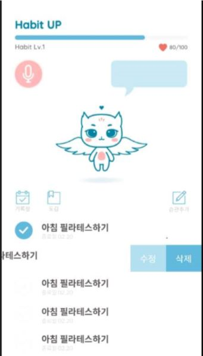
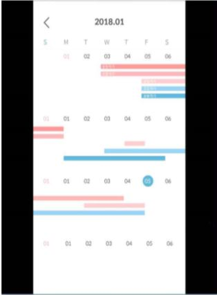
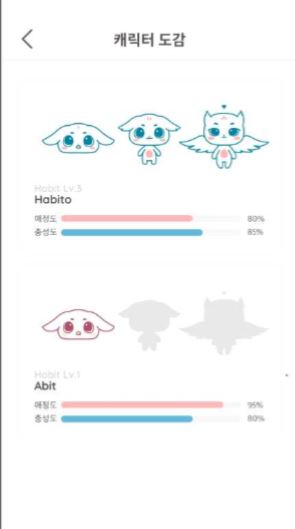

# Unithon

#### 2018 유니톤 공모전 특별상 프로젝트 

#### 사용자들의 습관을 캐릭터를 사용하여 성장하도록 도와주는 모바일 어플리케이션

1. api

* naver login
* naver calendar
* naver clova

2. glide를 사용한 gif 파일 처리

3. third-part library사용한 swipe-menu-listview 구현

